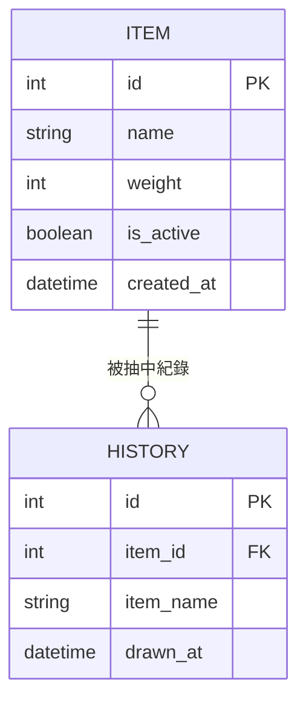

# 晚餐輪盤系統 — 資料庫設計文件 (DB_DESIGN)

本文件依據 `docs/PRD.md`、`docs/ARCHITECTURE.md` 與 `docs/FLOWCHART.md`，定義系統的 SQLite 資料表結構、欄位規格與 Python Model 對應關係。

---

## 1. ER 圖（實體關係圖）



> `ITEM` 與 `HISTORY` 為一對多關係：一個 `ITEM` 可以出現在多筆 `HISTORY` 紀錄中。
> `HISTORY` 中額外儲存 `item_name` 快照，是為了避免品項被刪除後歷史紀錄無法顯示名稱。

---

## 2. 資料表詳細說明

### 2-1 `items` — 晚餐品項表

| 欄位名稱 | 型別 | 必填 | 預設值 | 說明 |
|---|---|---|---|---|
| `id` | INTEGER | ✅ | AUTOINCREMENT | 主鍵，自動遞增 |
| `name` | TEXT | ✅ | — | 晚餐品項名稱（例如：麥當勞、巷口麵店） |
| `weight` | INTEGER | ✅ | `1` | 被抽中的相對機率權重，最小值為 1 |
| `is_active` | INTEGER | ✅ | `1` | 啟用狀態（SQLite 以 1=啟用、0=停用表示布林值） |
| `created_at` | TEXT | ✅ | 當下時間 | 建立時間，存為 ISO 8601 格式字串 |

**說明：**
- `weight` 決定轉盤面積比例，例如：`weight=3` 的品項被抽中機率為 `weight=1` 的三倍。
- `is_active=0` 時，該品項不會出現在轉盤上，但仍保留於資料庫（可再次啟用）。

---

### 2-2 `history` — 抽籤歷史紀錄表

| 欄位名稱 | 型別 | 必填 | 預設值 | 說明 |
|---|---|---|---|---|
| `id` | INTEGER | ✅ | AUTOINCREMENT | 主鍵，自動遞增 |
| `item_id` | INTEGER | ❌ | NULL | 外鍵，對應 `items.id`（品項刪除後設為 NULL） |
| `item_name` | TEXT | ✅ | — | 抽中時的品項名稱快照（防止刪除後遺失） |
| `drawn_at` | TEXT | ✅ | 當下時間 | 抽籤時間，存為 ISO 8601 格式字串 |

**說明：**
- `item_id` 使用 `ON DELETE SET NULL`，品項刪除後歷史紀錄仍可保留名稱快照。
- 查詢歷史紀錄時，優先顯示 `item_name`（不依賴 JOIN）。

---

## 3. 資料表關聯

```
items (1) ──────── (多) history
  id  ◄──────────── item_id (FK, nullable)
```

---

## 4. SQL 建表語法

詳見 `database/schema.sql`。

---

## 5. Python Model 對應

| 資料表 | Model 檔案 | 主要方法 |
|---|---|---|
| `items` | `app/models/item.py` | `create`, `get_all`, `get_active`, `get_by_id`, `update_weight`, `toggle_active`, `delete` |
| `history` | `app/models/history.py` | `create`, `get_recent`, `get_all` |
