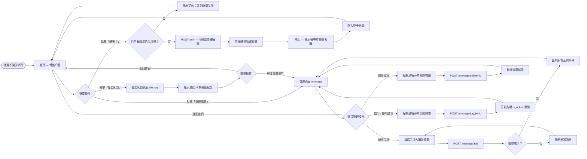
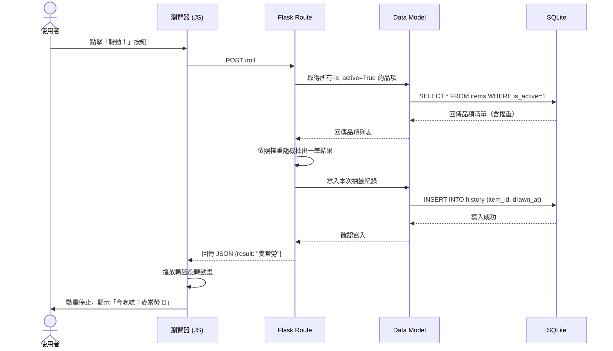
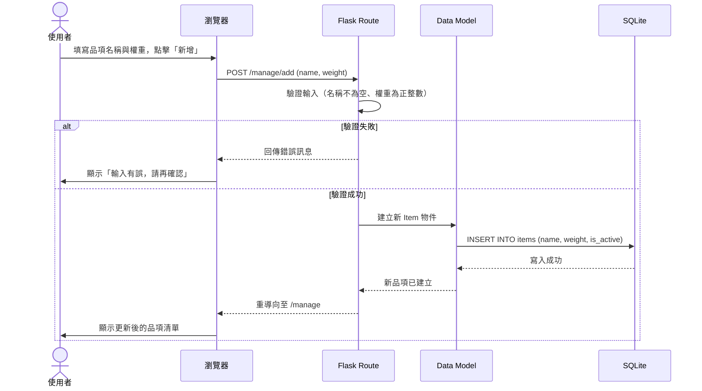
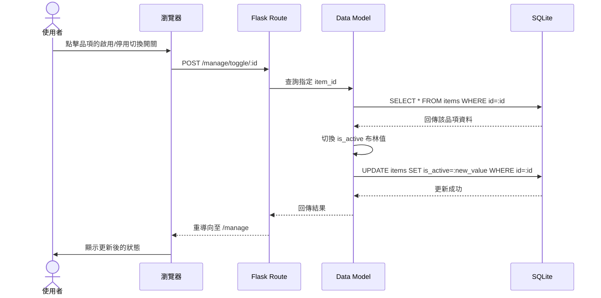

# 晚餐輪盤系統 — 流程圖文件 (FLOWCHART)

本文件依據 `docs/PRD.md` 與 `docs/ARCHITECTURE.md`，以 Mermaid 語法產出兩種流程圖（使用者流程圖、系統序列圖），並附上功能清單對照表。

---

## 1. 使用者流程圖（User Flow）

描述使用者從進入網站到完成各項操作的完整路徑，涵蓋轉盤抽籤、品項管理與歷史紀錄瀏覽。

---

## 2. 系統序列圖（Sequence Diagram）

描述使用者執行「轉盤抽籤」與「新增品項」時，各系統元件之間的完整互動流程。

### 2-1 轉盤抽籤流程

### 2-2 新增品項流程

### 2-3 啟用 / 停用品項流程

---

## 3. 功能清單對照表

| 功能說明 | URL 路徑 | HTTP 方法 | 對應模板 / 回應 |
|---|---|---|---|
| 首頁（轉盤介面） | `/` | GET | `templates/index.html` |
| 執行轉盤抽籤 | `/roll` | POST | JSON `{result: "品項名稱"}` |
| 品項管理頁面 | `/manage` | GET | `templates/manage.html` |
| 新增晚餐品項 | `/manage/add` | POST | 重導向至 `/manage` |
| 刪除晚餐品項 | `/manage/delete/<id>` | POST | 重導向至 `/manage` |
| 啟用 / 停用品項 | `/manage/toggle/<id>` | POST | 重導向至 `/manage` |
| 查看歷史紀錄 | `/history` | GET | `templates/history.html` |

---

> **說明**：
> - 所有寫入操作（新增、刪除、切換）均採用 `POST` 方法，符合 HTTP 語意。
> - 轉盤抽籤回傳 JSON，讓前端 `roulette.js` 接收後驅動動畫，避免頁面整個重新載入。
> - 品項的 `weight`（權重）欄位決定在轉盤上的面積比例與被抽中的機率。
> - `is_active` 欄位讓使用者可以暫時停用品項，而不需要刪除資料。
